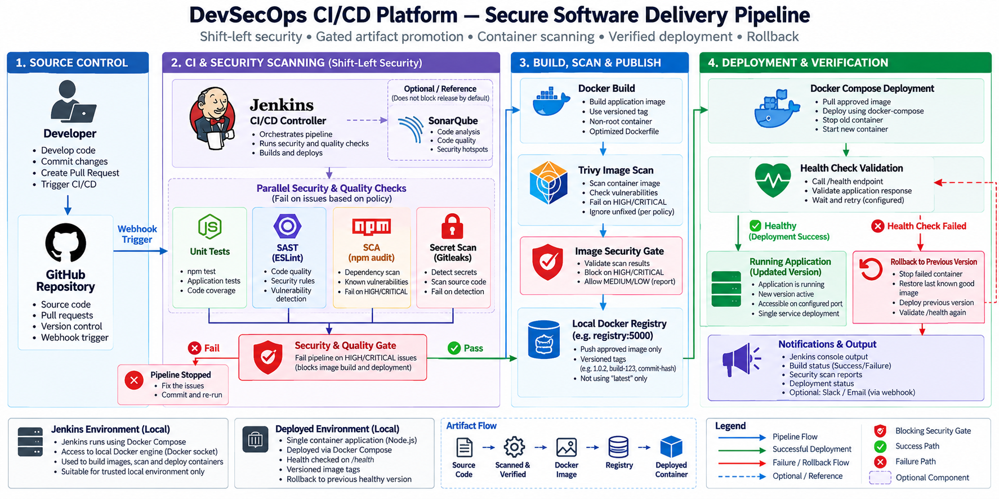

# DevSecOps CI/CD Platform

**Hands-on portfolio project** integrating source checks, tests, security scanning, image policy, and deployment verification into a Jenkins pipeline.

> **Scope:** a local DevSecOps implementation and learning project. AWS infrastructure is not deployed by default. It does not claim a production deployment or measured production security outcomes.

## Architecture

The pipeline fails at configured gates: unit tests, ESLint security rules, npm dependency audit, Gitleaks, and Trivy image scan. Only an artifact passing those checks proceeds to the local registry and Compose deployment. A failed health check triggers restoration of the last recorded healthy image where one exists. Thresholds are project choices, not universal standards.

See architecture/architecture.md for flow and trust boundaries.

## What this project demonstrates

- **Shift-left checks:** ESLint with eslint-plugin-security, unit tests, npm audit, and Gitleaks run before publication.
- **Artifact checks:** Trivy reports lower-severity findings and blocks built images with HIGH or CRITICAL vulnerabilities; unfixed findings are excluded by policy.
- **Gated delivery:** a failed test or scanner exits nonzero, stopping the pipeline before push and deployment.
- **Versioned releases:** image tags include the Jenkins build number and Git commit prefix; the pipeline does not use latest.
- **Recovery path:** Compose deployment validates /health and attempts rollback to the previous image after a failed health check.
- **Local reproducibility:** Node tests, a local Jenkins controller, and a local Docker registry are provided. SonarQube config is optional; no scan is represented as having passed.

## Repository layout

    app/                 Node.js HTTP API, tests, Dockerfile
    Jenkinsfile          Declarative CI/CD pipeline
    jenkins/              Local Jenkins + registry Compose setup and image
    security/             Gitleaks, Trivy and optional SonarQube configuration
    deployment/           Runtime Compose file and deploy/rollback scripts
    architecture/         PNG diagram and architecture notes
    docs/                 Security, pipeline, failure, rollback and interview guides
    scripts/               Safe failure-path demonstrations

## Prerequisites

- Node.js 22+ and npm
- Docker Desktop / Docker Engine with Compose v2, running for container and Jenkins exercises
- Git

Node application tests need neither Docker nor an AWS account. The Jenkins image build downloads scanner releases and Jenkins plugins, so it requires network access the first time.

## Run and test the app locally

    cd app
    npm ci
    npm test
    npm run lint
    npm audit --audit-level=high
    APP_VERSION=1.0.0 PORT=3000 npm start

In another terminal, query /health, /version, and / with curl at localhost:3000. Stop with Ctrl-C. The process handles SIGINT/SIGTERM and stops accepting new connections before exiting.

## Build and run a container

From the repository root:

    docker build -t devsecops-demo-api:local --build-arg APP_VERSION=1.0.0 app
    docker run --rm --name devsecops-demo -p 8080:3000 devsecops-demo-api:local

Then query localhost:8080/health and /version. If that port is already occupied, use 18080:3000 instead. The Compose deployment publishes only to 127.0.0.1:18080 by default; set APP_HOST_PORT to another free port and update Jenkinsfile APP_HOST_PORT/HEALTH_URL to match if needed. The image uses a multi-stage install, production dependencies only, a non-root Node user, a health check, and no embedded credentials.

## Local Jenkins and registry

The Jenkins controller mounts the local Docker socket so the pipeline can build, scan, push, and deploy using the host Docker engine. This grants Jenkins broad control over that engine. Use this disposable learning setup only on a trusted machine; do not expose it publicly or run untrusted pull-request code on this agent.

    docker compose -f jenkins/compose.yml build
    docker compose -f jenkins/compose.yml up -d

Open http://localhost:8081 and complete the Jenkins setup wizard (read its initial unlock password with docker compose -f jenkins/compose.yml logs jenkins). Create a Pipeline job pointing to the root Jenkinsfile, or configure a Multibranch Pipeline for branch-aware main release stages. If Docker socket access is denied, set DOCKER_GID to the socket group ID when starting Compose (on macOS, use stat -f %g /var/run/docker.sock). The local registry is at localhost:5000. Jenkins console output is the built-in notification channel. Jenkins data persists in a named volume.

1. Configure the job to load the root Jenkinsfile from SCM.
2. For Multibranch, allow the main branch to run push/deploy stages.
3. Keep Jenkins loopback-only and use Jenkins credentials for optional external registry or webhook integrations.
4. Start a pipeline build. The first image build may take several minutes while caches warm.

Stop with docker compose -f jenkins/compose.yml down. Use down -v only if you intentionally want to erase Jenkins job data.

## Pipeline stages and gates

| Stage | Check or action | Release effect |
|---|---|---|
| Checkout and version | Git commit plus build-number tag | Produces unique version |
| Install and unit tests | npm ci, Node tests with coverage report | Test failure blocks release; coverage is informational |
| SAST / lint | ESLint security rules | Finding blocks release |
| Dependency SCA | npm audit --audit-level=high | HIGH/CRITICAL audit exit blocks release |
| Secret scan | Gitleaks Git scan, redacted output | Detected secret blocks release |
| Docker build | Build app image with version metadata | Failure blocks release |
| Image vulnerability gate | Trivy, HIGH/CRITICAL, ignore unfixed | Configured findings block push |
| Push approved image | Push to local registry on main | Only after preceding gates |
| Deploy and health validation | Compose plus /health polling | Failure invokes prior-image rollback |

A successful build alone does not mean a release is approved. The configured gates decide whether the artifact can continue. Optional SonarQube is not wired into the required Jenkins path because the service and credentials are optional.

## Security tooling

- **Gitleaks** scans repository content/history for credential patterns. Use the safe temporary fixture in docs/security.md; never commit a real secret to test detection.
- **ESLint security plugin** provides fast local source analysis. It complements code review; it is not a guarantee of secure code.
- **npm audit** checks the lockfile against npm advisory data. It requires network access and results can change as advisories are updated.
- **Trivy** scans the built image. The selected gate fails on HIGH and CRITICAL findings and excludes unfixed issues. This is the project's chosen release policy.
- **SonarQube Community Build** can be started separately for richer analysis and quality gates. No result is claimed unless you run it.

## Deployment and rollback

Jenkins pushes the versioned image to the local registry and runs deployment/scripts/deploy.sh. The deploy script records the last healthy image reference in an ignored local state file. A failed health check attempts to bring that reference back and checks it again. If rollback cannot recover health, the script exits nonzero and requests operator action. This is a simple single-service local deployment, not a zero-downtime system.

Validate rollback control flow without Docker:

    scripts/test-rollback.sh

That test stubs Docker and curl: it verifies the rollback command path, but does not run containers. For real local deployment the Docker daemon must be running.

## Validation performed

The implementation was exercised locally:

- Node unit tests passed with coverage reporting enabled, ESLint security rules passed, and npm audit reported zero known vulnerabilities at scan time. Coverage is informational; no minimum percentage is enforced.
- Gitleaks directory scan had no findings. The temporary configured canary was detected and returned nonzero as expected.
- Trivy filesystem scan and built-image report/gate completed; no HIGH/CRITICAL image findings remained after removing unused bundled npm/Yarn trees from runtime.
- Docker image build and container startup passed; the container ran as node and reported healthy.
- Local registry push, Compose deployment, /health and /version checks passed.
- Rollback branch: stubbed Docker/curl test passed; this is not a live failed-container recovery test.
- Jenkins custom image built; the controller login endpoint and installed tool versions responded. The Jenkinsfile was not run as a configured Jenkins job in this validation.

SonarQube and Slack/email integrations were not run. Trivy results depend on the database snapshot and should be refreshed for future releases.

## Safe failure demonstrations

    cd app && node --test test/failing-test.example.cjs
    cd .. && scripts/test-rollback.sh

The first command should exit nonzero. Gitleaks demo steps are in docs/security.md; the fixture is created under a temporary directory and removed afterward.

## Documentation

- [Security design](docs/security.md)
- [Pipeline operation](docs/pipeline.md)
- [Failure scenarios](docs/failure-scenarios.md)
- [Rollback behavior](docs/rollback.md)
- [Interview guide](docs/interview-guide.md)

## Limitations and claims

- **Hands-on scope:** local app/tests, configured Docker and Jenkins pipeline, scanner policies, local registry, Compose deployment, health validation, and rollback path.
- **Reference / optional:** GitHub branch protection, external registry, SonarQube analysis, Slack/email, and cloud infrastructure.
- Docker, Jenkins, and image scan results depend on the local runtime and current vulnerability feeds. Rerun checks for each release.
- This is not a production deployment and makes no claim of a production audit, zero downtime, or passing a quality gate that has not been observed.
- **AWS infrastructure is not deployed by default.** The project creates no cloud resources.

## Reproduce the checks

    cd app && npm ci && npm test && npm run lint && npm audit --audit-level=high
    cd ..
    gitleaks git --redact --config security/gitleaks/.gitleaks.toml .
    trivy fs --config security/trivy/trivy.yaml --severity HIGH,CRITICAL --exit-code 1 .
    scripts/test-rollback.sh
    docker compose -f jenkins/compose.yml config

Image build/scan, Jenkins execution, and Compose deployment require a running Docker daemon. Report actual results rather than inferring them from configuration.
